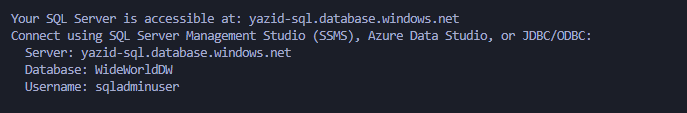

# Azure SQL Deployment Script

This PowerShell script automates the deployment of a sample SQL database to Azure. It performs the following steps:

1. **Downloads** a `.bacpac` backup file of the WideWorldImportersDW database from GitHub.
2. **Uploads** the file to an Azure Blob container.
3. **Creates** a new Azure SQL Server.
4. **Imports** the database into the server.
5. **Configures firewall rules** to allow access from:
   - The current user's public IP.
   - Azure services (e.g., import/export).

At the end of the script, it prints the **fully qualified domain name (FQDN)** of the Azure SQL Server for easy connection.

---

## 🛠️ Prerequisites

Before running the script, make sure:

- You have the **Az PowerShell modules** installed:
  ```powershell
  Install-Module -Name Az -Scope CurrentUser -Repository PSGallery -Force
  ```

- You're signed in to Azure:
  ```powershell
  Connect-AzAccount
  ```

- You’ve created a `.env` file in the root directory with your SQL Admin password:
  ```env
  DB_PASSWORD=YourDatabasePasswordHere
  ```

---
## 🚀 How to Launch the Script

To run the deployment script from your terminal, use the following command:

```bash
powershell ./deploy-db.ps1
```
---


## 🧪 How to Preview the Data in SQL Server Management Studio (SSMS)

### Step 1 — Launch the script  
Run the deployment script from your terminal:  
```bash
powershell ./deploy-db.ps1
```
The script will output the **SQL Server endpoint** and **admin username** to use in SSMS.  


---

### Step 2 — Monitor import progress  
Go to [Azure Portal](https://portal.azure.com) → **Resource Groups** → your group → **SQL Server** → **Data management** → **Import/Export History** to track the import percentage.  


---

### Step 3 — Connect via SSMS  
Open **SQL Server Management Studio (SSMS)** and log in using the server endpoint and admin credentials printed by the script.  


---

### Step 4 — Browse the data  
Expand `Databases` → `WideWorldDW` → `Tables` → right-click any table → **Select Top 1000 Rows**.  


---

### Step 5 — View your table  
The data from the `.bacpac` file will be visible.  


---
## 💥 Common Issues Encountered and Fixes

| Issue | Cause | Fix |
|------|-------|-----|
| `This request is not authorized to perform this operation using this permission` | Missing or insufficient permissions on the storage account | Switched from Azure AD auth to **access key-based auth** for blob upload/download |
| `Location is not accepting creation of new SQL Servers` | Some regions are restricted or overloaded | Changed region from `Canada East` to `Canada Central` |
| `COLUMNSTORE is not supported in this service tier` | The database requires premium-tier features | Upgraded SQL database tier to `Premium` (P1) |
| Import stuck at `0%` | Azure Import/Export operation in progress | Use `Get-AzSqlDatabaseImportExportStatus` with the operation link to monitor progress |
| Tables were empty | Import failed silently due to tier mismatch | Verified via SSMS and fixed with correct tier |

---

## 📌 Notes

- The database tier is set to `Premium P1` to support columnstore indexes used in WideWorldImportersDW.
- The firewall is auto-configured for current IP and Azure access.

---

## 🔐 Security

Your database password is read from the `.env` file. For production use, consider storing secrets securely using [Azure Key Vault](https://learn.microsoft.com/en-us/azure/key-vault/general/overview).
